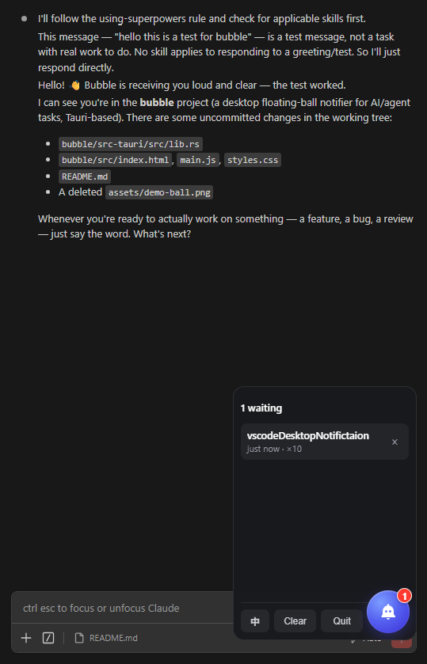

# bubble 🫧

A tiny always-on-top desktop **floating ball** that tracks your AI coding sessions
(Claude Code and Codex) and lets you jump straight back to the right editor window.

The panel shows sessions **waiting for you** on top (a finished turn with no background
agents still working, or a permission prompt), and below them one row per project whose
VS Code window is open and that saw activity in the **last 24 hours**, with running ones
marked. Click any row to **switch to that project's
VS Code window**. The red badge counts only the waiting sessions, and a waiting row
clears itself once you answer it in the editor, even if you never touched the ball.

<p align="center"></p>

---

## Why

A finish sound tells you *something* is done, but not **which** of your projects now
needs you. bubble turns "an agent stopped" into a glanceable, clickable queue: the
badge is your count, and one click takes you to the window that's waiting.

## How it works

```
  prompt sent / turn finished / permission asked / session closed
            │  (Claude hooks run a command)
            ▼
  hook/bubble-hook.js  ──writes one JSON file──▶  ~/.claude/bubble/inbox/  ─┐
                                                                             │
  ~/.claude/projects/*/*.jsonl  (Claude transcripts)  ─────────────────────┤ ball polls
  ~/.codex/sessions/**/rollout-*.jsonl  (Codex rollouts)  ─────────────────┤ every 1.5s
                                                                             ▼
                                            one row per session: running / waiting
                                            badge = waiting count, pulse on new wait
                                            click a row → focus its editor window
                                            waiting rows clear once answered anywhere
```

Three decoupled pieces, each with one job:

- **Collector** — `hook/bubble-hook.js`, a small Node script run by Claude Code's
  hooks, plus the ball's own read-only scan of Claude and Codex transcripts. It writes one JSON file per event into
  `~/.claude/bubble/inbox/` (one file per event = zero write contention, survives the
  ball being closed).
- **Store** — `~/.claude/bubble/`: an `inbox/` the ball drains, plus a `state.json`
  the ball owns and a `pos.json` remembering where you dragged the ball.
- **Ball** — a [Tauri](https://tauri.app) app (Rust + a system WebView, ~30&nbsp;MB
  RAM). Polls the inbox and transcripts, and switches editor windows.

## Features

- **Waiting and last-hour sessions, per session** — two sessions in the same folder are two rows. A turn that ends while background agents keep working is not reported as waiting.
- **Auto-clear** — send a new prompt or answer a permission prompt in the editor and the waiting row goes away.
- **Always visible** — coloured while anything runs or waits, grey when idle; pulses when a session starts waiting.
- **One-click window switching** — jumps to the editor window for that session's project.
- **Draggable & remembered** — drag it anywhere; position persists across launches.
- **Opens toward the screen center** — panel expands up or down so it never falls off an edge; the ball itself never moves.
- **Light** — system WebView, no bundled Chromium.
- **Single instance** — a second launch just exits.
- **Bilingual UI** — English / 中文, auto-detected from your system language.

## Platform support

| Platform | Status |
| --- | --- |
| **Windows** | ✅ Fully working & tested. Precise window focus via a Win32 helper (`EnumWindows` + foreground-lock bypass). |
| **macOS / Linux** | ⚙️ Builds and runs. Window switching falls back to `code <path>`, which opens/focuses the folder but may reuse a window instead of raising the exact one. A native focus-by-title helper (AppleScript / Accessibility API on macOS, `wmctrl`/similar on Linux) is **welcome as a PR** — see [`focus_or_open` in lib.rs](bubble/src-tauri/src/lib.rs). |

## Build

Prereqs: [Rust](https://rustup.rs) ≥ 1.85, Node ≥ 18, and the `code` CLI on your PATH.
On Windows the WebView2 runtime ships with Windows 11.

```bash
cd bubble/src-tauri
cargo build --release
# → target/release/bubble  (bubble.exe on Windows)
```

Or the Tauri dev/bundler flow: `cd bubble && npm install && npm run tauri dev`.

Run the binary and it sits quietly (hidden) until a task arrives. To auto-start it,
add it to your OS login items (Windows: `shell:startup`; macOS: Login Items /
LaunchAgent; Linux: your desktop's autostart).

## Wiring it to your AI tool

bubble is driven by a hook that runs a command when a session finishes.

> **Easiest way — just ask your AI to wire it up.** Since you're already using an AI
> coding agent, hand it this task. In Claude Code, say:
>
> > *Add a `Stop` hook to my `~/.claude/settings.json` that runs
> > `node "<absolute-path-to>/hook/bubble-hook.js"`, keeping any existing hooks. Then
> > start `bubble` (the built binary).*
>
> It'll edit the settings, verify the JSON, and can launch the app for you. The manual
> steps below are the fallback if you'd rather do it by hand.

For **Claude Code**, add the same command to four events in `~/.claude/settings.json`:

```json
{
  "hooks": {
    "UserPromptSubmit": [{ "hooks": [{ "type": "command", "command": "node \"/ABSOLUTE/PATH/TO/hook/bubble-hook.js\"" }] }],
    "Stop":             [{ "hooks": [{ "type": "command", "command": "node \"/ABSOLUTE/PATH/TO/hook/bubble-hook.js\"" }] }],
    "Notification":     [{ "hooks": [{ "type": "command", "command": "node \"/ABSOLUTE/PATH/TO/hook/bubble-hook.js\"" }] }],
    "SessionEnd":       [{ "hooks": [{ "type": "command", "command": "node \"/ABSOLUTE/PATH/TO/hook/bubble-hook.js\"" }] }]
  }
}
```

Claude Code reads hooks when a session starts, so restart open sessions after editing.
Sessions that started earlier still show up: the ball also reads
`~/.claude/projects/*/*.jsonl` directly.

For **Codex**, no hook is needed for running/finished state: the ball reads
`~/.codex/sessions/**/rollout-*.jsonl`. Optionally point Codex's `notify` at
`hook/codex-bubble-notify.js` as a second finish signal. Its events carry `"agent":"codex"` and only count for sessions already tracked from a rollout: the Codex extension also runs rollout-less helper threads (e.g. title generation) whose turns fire `notify` too.

### VS Code companion extension

`bubble/vscode-ext/` is a tiny extension that makes clicks and "seen" per session
instead of per window. It is built for sessions kept in the **sidebar**:

- **Click a row** → the ball focuses the project window, then opens the session there:
  Claude via `~/.claude/bubble/open.json` (the window whose workspace contains the
  session's folder claims it and runs `claude-vscode.editor.open`, honoring
  `claudeCode.preferredLocation`: sidebar or tab; no URI, so no "allow extension to open
  this URI?" prompt), Codex via Codex's own `vscode://openai.chatgpt/local/<id>`
  (switches its sidebar).
  Set `"claudeCode.preferredLocation": "sidebar"` so Claude sessions open there too.
- **Stay 15 seconds** in a focused window whose sidebar shows the waiting session → its
  row clears, even if you never answer it. Which session is shown comes from:
  - Claude: that window's own `Claude VSCode.log` (found via the extension's `logUri`),
    where the webview logs `update_session_state` for the session it hosts and
    `isFarewell` when it switches away.
  - Codex: Codex's local IPC pipe `\\.\pipe\codex-ipc`; a view showing a conversation
    broadcasts `thread-stream-following-changed`. The extension listens only (it declines
    every request) and the ball matches the conversation's project to the window.

  The extension sends a `seen` heartbeat per shown session every 5s while the window is
  focused; the ball does the 15s check.

Install (needs Node and the `code` CLI; repeat after editing the extension):

```bash
cd bubble/vscode-ext && npm run install-local
```

VS Code asks once to allow the extension to open bubble's links.

Keep (or add) your finish sound as a second command in the same array — the beep is
independent of bubble:

- Windows: `rundll32 user32.dll,MessageBeep -1`
- macOS: `afplay /System/Library/Sounds/Glass.aiff`
- Linux: `paplay /usr/share/sounds/freedesktop/stereo/complete.oga`

### Feeding bubble from anything else

The hook is just a JSON writer. Any tool can feed the ball by dropping a file into
`~/.claude/bubble/inbox/` (filename can be anything ending in `.json`):

```json
{ "cwd": "/path/to/project", "project": "myproject", "session_id": "abc", "ts": 1700000000000 }
```

`project` defaults to the basename of `cwd`; `ts` defaults to now.

## Usage

- **Drag** the ball to move it (position is remembered).
- **Single click** the ball → open the panel; click again / `Esc` / click elsewhere → close.
- **Click a row** → switch to its editor window and, with the companion extension, to that session's tab. A waiting row moves back to the recent list.
- **×** hides a row until that session does something new; **Clear** moves all waiting rows back to the recent list; **Quit** exits.

## Architecture notes & deliberate trade-offs

- Rows are keyed by session id; the state machine lives in `bubble/src-tauri/src/sessions.rs`. Transcripts fill the gaps hooks cannot report: an Esc interrupt, a permission prompt answered in the editor, background agents still writing under `<session>/subagents/`, a session that died (no transcript growth for 20 minutes).
- Codex keeps its rollout file open on Windows, so its modified time never moves; activity is detected by file size instead.
- Window switching matches by title (`<project> - Visual Studio Code`); two projects with the same folder name could match the wrong window. The same title match decides which sessions are tracked at all (Windows only; elsewhere every session is tracked).
- The ball polls the inbox every 1.5s (no filesystem watcher).
- "Seen" reads undocumented internals: the Claude extension's info-level log line `Received message from webview:` and Codex's IPC frames (4-byte little-endian length + JSON). An update of either extension can silently break it; clicks and answers keep working. "Shown" means mounted in the sidebar, so a collapsed sidebar, or the Codex container covering Claude's, still counts. Closing a Claude editor tab logs no farewell, so a closed tab's session keeps counting as shown until the window reloads.
- The list shows project, the first line of the latest prompt (or the permission request), and time; no summary.
- On Windows the collapsed window is 136px wide (OS minimum for a captioned window); the extra area is transparent and clicks pass through it.

## Contributing

Issues and PRs welcome. The most impactful contribution right now is **native
window-focus for macOS and Linux** (see Platform support above). Please keep the
"one file, one job" structure and match the existing style.

## License

[MIT](LICENSE)
